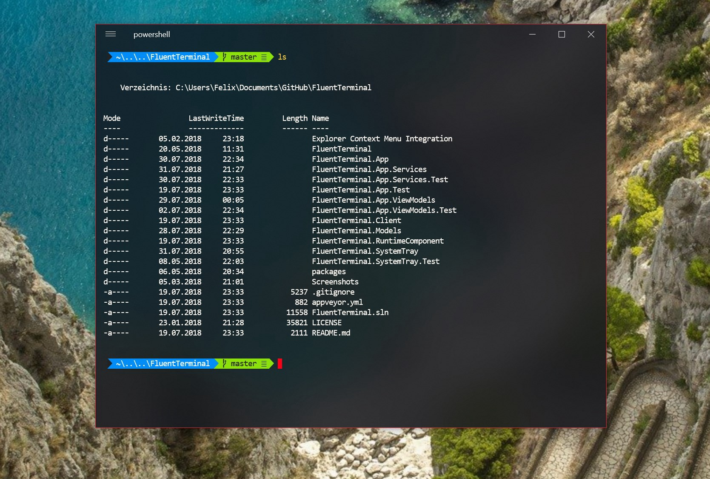

<div style="text-align:center;">
    <h1>
        windows terminal 配置文件使用说明
    </h1>
    
</div>

配置`Windows Terminal`的一种方法（当前是唯一的方法）是通过编辑`profiles.json`设置文件。可以通过点击下拉菜单的`设置`按钮使用默认编辑器编辑配置文件。

<div style="text-align:center;">
    
</div>

该文件的完整路径是`C:\Users\Administrator\AppData\Local\Packages\Microsoft.WindowsTerminal_8wekyb3d8bbwe\LocalState\profiles.json`。

从 [#2515](https://github.com/microsoft/terminal/pull/2515)开始，设置被拆分为两个文件：硬编码的`defaults.json`和`profiles.json`，其中包含用户设置。`defaults.json`文件仅作为默认设置的参考被提供。要查看``defaults.json``文件，请在按住Alt键的同时单击“设置”按钮。

可以在[此处](https://github.com/microsoft/terminal/blob/master/doc/cascadia/SettingsSchema.md)找到特定设置的详细信息。下面仅提供一般介绍。

设置分为四个标题：

1. 全局属性：设置被应用到整个应用，例如：默认的配置文件，初始大小等等。
2. keybindings：全局设置的子集，稍后会单独讨论。
3. Profiles：使用该配置文件打开选项卡时将应用于该选项卡的一组设置。—— 负责单个选项卡的行为
4. Schemes：配置文件可以使用的背景，文本等颜色集。—— 负责单个选项卡的外观

#### 全局设置

***

这些设置定义了启动默认值以及可能不会影响特定终端实例的应用程序范围的设置。

示例设置如下：

```json
"defaultProfile" : "{58ad8b0c-3ef8-5f4d-bc6f-13e4c00f2530}",
"initialCols" : 120,
"initialRows" : 50,
"requestedTheme" : "system",
"keybindings" : []
...
```

这些全局属性可以存在于根json对象中，也可以存在于根属性`globals`下的对象中。

#### keybindings

***

这是一组用于调用各种命令的组合快捷键。每个命令可以具有多个键绑定。

> 👉按键绑定是全局设置的子字段，按键绑定以相同的方式应用于所有配置文件。

例如，这是默认按键绑定的示例：

```json
{
    "keybindings":
    [
        { "command": "closePane", "keys": ["ctrl+shift+w"] },
        { "command": "copy", "keys": ["ctrl+shift+c"] },
        { "command": "paste", "keys": ["ctrl+shift+v"] },
        { "command": "newTab", "keys": ["ctrl+shift+t"] },
        // etc.
    ]
}
```

keys也可以用单一字符串，不适用数组：

```json
{
    "keybindings":
    [
        { "command": "closePane", "keys": "ctrl+shift+w" },
        { "command": "copy", "keys": "ctrl+shift+c" },
        { "command": "newTab", "keys": "ctrl+shift+t" },
        // etc.
    ]
}
```

##### 解除绑定

如果默认按键绑定和其他应用的按键绑定冲突，可以使用如下方式解除绑定

```js
{
    "command" : null, "keys" : ["ctrl+shift+6"]
},
```

#### Profiles

***

包含一个`profile`数组，每一个`profile`包含了将被运用到一个新打开的wt

标签页上的配置。每个`profile`都由`GUID`标识，并包含许多其他字段。

> 👉`guid`是一个`profile`的唯一标识符。如果多个`profile`拥有相同的`guid`属性，你也许会看到难以预料的行为。

+ 启动时执行的命令
+ 启动目录
+ 使用哪种配色方案（请参阅下面的`Schemes`）
+ 字体和大小
+ 各种设置来控制外观。例如。不透明度，图标，光标外观，显示名称等

一个例子：

```json
{
    "guid": "{c6eaf9f4-32a7-5fdc-b5cf-066e8a4b1e40}",
    "hidden": false,
    "name": "Ubuntu-18.04",
    "source": "Windows.Terminal.Wsl",
    "cursorColor" : "#FFFFFF",
    "cursorShape" : "bar",
    "fontFace" : "Hack",
    "fontSize" : 10
}
```

> 👉注意：要在任何路径字段中使用反斜杠，您需要按照JSON转义规则对它们进行转义。

##### 隐藏profile

如果要从新选项卡下拉列表中的配置文件列表中删除配置文件，但仍将配置文件保留在`profiles.json`文件中，则可以将属性`"hidden":true`添加到配置文件的json中。

#### Color Schemes

***

每种方案都定义了用于各种终端转义序列的颜色值。每个方案由名称字段标识

```json
 "name" : "Campbell",
 "background" : "#0C0C0C",
 "black" : "#0C0C0C",
 "blue" : "#0037DA",
 "foreground" : "#F2F2F2",
 "green" : "#13A10E",
 "red" : "#C50F1F",
 "white" : "#CCCCCC",
 "yellow" : "#C19C00"
 ...
```

然后可以在一个或多个配置文件中引用方案名称。

```json
{
"profiles":
    [
        {
            "guid": "{c6eaf9f4-32a7-5fdc-b5cf-066e8a4b1e40}",
            "hidden": false,
            "name": "Ubuntu-18.04",
            "source": "Windows.Terminal.Wsl",
            "cursorColor" : "#ffab85",
            "cursorShape" : "bar",
            "fontFace" : "Hack",
            "fontSize" : 10,
            "colorScheme": "pink style"
        }
    ],

    // Add custom color schemes to this array
    "schemes": [
        {
            "name": "pink style",
            "background": "#ffab85",
            "foreground" : "#f2f2f2"
        }
    ],
}
```

#### 设置分层

***

运行时设置实际上是从三个来源构造的：

+ 默认设置：被硬编码到应用程序中，由`defaults.json`配置。
+ 动态配置文件：在运行时生成。其中包括`Powershell Core`，`Azure Cloud Shell`连接器以及`WSL`发行版的配置文件。
+ 来自`profiles.json`的用户设置。

每个来源的设置都位于上一个来源设置之上，已达到覆盖的目的。

##### Dynamic Profiles

在运行时创建动态配置文件后，会将它们添加到`profiles.json`文件。您可以通过存在`source`属性来标识这些概要文件。

这些配置文件与它们的来源相关联-如果您卸载`linux`发行版，则该配置文件将保留在`profiles.json`文件中，但该配置文件将被隐藏。

Windows终端使用这些动态生成的配置文件的`guid`属性来唯一地标识它们。如果您尝试更改动态生成的配置文件的`GUID`，终端将自动为该配置文件重新创建一个新条目。