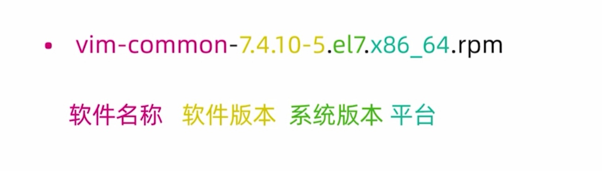

### 软件包管理器

包管理器是方便软件安装、卸载、解决软件依赖关系的重要工具。

+ centos、redhat使用`yum` 包管理器，软件安装包格式为`rpm`
+ Debian、Ubuntu使用`apt` 包管理器，软件安装包格式为`deb`

#### rpm包格式

<div>
    
</div>

#### rpm命令安装

+ rpm -q 查询
+ rpm -i 安装
+ rpm -e 卸载

缺点：

1. 需要自己解决依赖
2. 软件包来源不可靠

#### yum包管理器

CentOS yum源：http://mirror.centos.org/centos/7/

国内镜像：https://opsx.alibaba.com/mirror

yum配置文件

+ `/etc/yum.repos.d/CentOS-Base.repo`

  ```sh
  # CentOS-Base.repo
  #
  # The mirror system uses the connecting IP address of the client and the
  # update status of each mirror to pick mirrors that are updated to and
  # geographically close to the client.  You should use this for CentOS updates
  # unless you are manually picking other mirrors.
  #
  # If the mirrorlist= does not work for you, as a fall back you can try the
  # remarked out baseurl= line instead.
  #
  #
  
  [base]
  name=CentOS-$releasever - Base
  mirrorlist=http://mirrorlist.centos.org/?release=$releasever&arch=$basearch&repo=os&infra=$infra
  #baseurl=http://mirror.centos.org/centos/$releasever/os/$basearch/
  gpgcheck=1
  gpgkey=file:///etc/pki/rpm-gpg/RPM-GPG-KEY-CentOS-7
  
  #released updates
  [updates]
  name=CentOS-$releasever - Updates
  mirrorlist=http://mirrorlist.centos.org/?release=$releasever&arch=$basearch&repo=updates&infra=$infra
  #baseurl=http://mirror.centos.org/centos/$releasever/updates/$basearch/
  gpgcheck=1
  gpgkey=file:///etc/pki/rpm-gpg/RPM-GPG-KEY-CentOS-7
  
  #additional packages that may be useful
  [extras]
  name=CentOS-$releasever - Extras
  mirrorlist=http://mirrorlist.centos.org/?release=$releasever&arch=$basearch&repo=extras&infra=$infra
  #baseurl=http://mirror.centos.org/centos/$releasever/extras/$basearch/
  gpgcheck=1
  gpgkey=file:///etc/pki/rpm-gpg/RPM-GPG-KEY-CentOS-7
  
  #additional packages that extend functionality of existing packages
  [centosplus]
  name=CentOS-$releasever - Plus
  mirrorlist=http://mirrorlist.centos.org/?release=$releasever&arch=$basearch&repo=centosplus&infra=$infra
  #baseurl=http://mirror.centos.org/centos/$releasever/centosplus/$basearch/
  gpgcheck=1
  enabled=0
  gpgkey=file:///etc/pki/rpm-gpg/RPM-GPG-KEY-CentOS-7
  ```

+ 配置阿里云镜像 

  ```sh
  wget -O /etc/yum.repos.d/CentOS-Base.repo http://mirrors.aliyun.com/repo/Centos-6.repo
  ```

  ```sh
  # CentOS-Base.repo
  #
  # The mirror system uses the connecting IP address of the client and the
  # update status of each mirror to pick mirrors that are updated to and
  # geographically close to the client.  You should use this for CentOS updates
  # unless you are manually picking other mirrors.
  #
  # If the mirrorlist= does not work for you, as a fall back you can try the
  # remarked out baseurl= line instead.
  #
  #
  
  [base]
  name=CentOS-$releasever - Base - mirrors.aliyun.com
  failovermethod=priority
  baseurl=http://mirrors.aliyun.com/centos/$releasever/os/$basearch/
          http://mirrors.aliyuncs.com/centos/$releasever/os/$basearch/
          http://mirrors.cloud.aliyuncs.com/centos/$releasever/os/$basearch/
  gpgcheck=1
  gpgkey=http://mirrors.aliyun.com/centos/RPM-GPG-KEY-CentOS-6
  
  #released updates
  [updates]
  name=CentOS-$releasever - Updates - mirrors.aliyun.com
  failovermethod=priority
  baseurl=http://mirrors.aliyun.com/centos/$releasever/updates/$basearch/
          http://mirrors.aliyuncs.com/centos/$releasever/updates/$basearch/
          http://mirrors.cloud.aliyuncs.com/centos/$releasever/updates/$basearch/
  gpgcheck=1
  gpgkey=http://mirrors.aliyun.com/centos/RPM-GPG-KEY-CentOS-6
  
  #additional packages that may be useful
  [extras]
  name=CentOS-$releasever - Extras - mirrors.aliyun.com
  failovermethod=priority
  baseurl=http://mirrors.aliyun.com/centos/$releasever/extras/$basearch/
          http://mirrors.aliyuncs.com/centos/$releasever/extras/$basearch/
          http://mirrors.cloud.aliyuncs.com/centos/$releasever/extras/$basearch/
  gpgcheck=1
  gpgkey=http://mirrors.aliyun.com/centos/RPM-GPG-KEY-CentOS-6
  
  #additional packages that extend functionality of existing packages
  [centosplus]
  name=CentOS-$releasever - Plus - mirrors.aliyun.com
  failovermethod=priority
  baseurl=http://mirrors.aliyun.com/centos/$releasever/centosplus/$basearch/
          http://mirrors.aliyuncs.com/centos/$releasever/centosplus/$basearch/
          http://mirrors.cloud.aliyuncs.com/centos/$releasever/centosplus/$basearch/
  gpgcheck=1
  enabled=0
  gpgkey=http://mirrors.aliyun.com/centos/RPM-GPG-KEY-CentOS-6
  
  #contrib - packages by Centos Users
  [contrib]
  name=CentOS-$releasever - Contrib - mirrors.aliyun.com
  failovermethod=priority
  baseurl=http://mirrors.aliyun.com/centos/$releasever/contrib/$basearch/
          http://mirrors.aliyuncs.com/centos/$releasever/contrib/$basearch/
          http://mirrors.cloud.aliyuncs.com/centos/$releasever/contrib/$basearch/
  gpgcheck=1
  enabled=0
  gpgkey=http://mirrors.aliyun.com/centos/RPM-GPG-KEY-CentOS-6
  ```

### 源代码编译安装

### 内核升级

### grub配置文件

