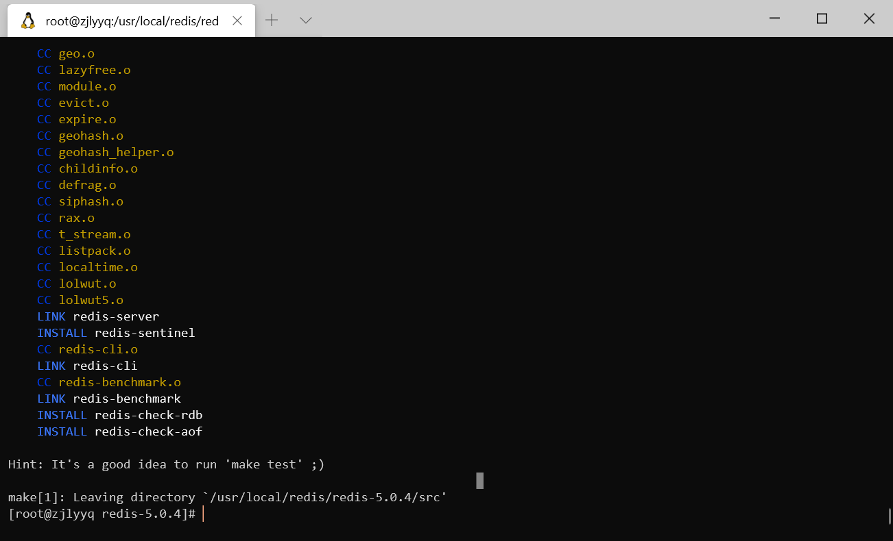
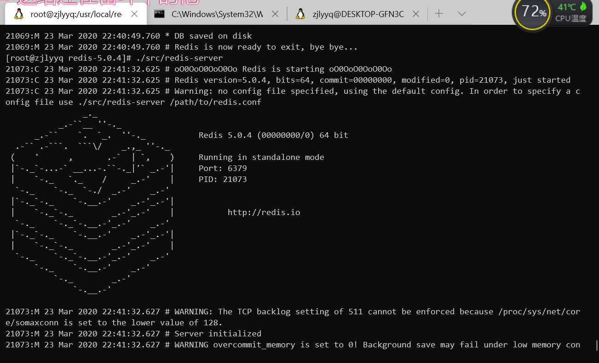

<div style="text-align:center;">
    <h2>
        centos 7安装redis
    </h2>
    
    <p style="color:rgba(0,0,0,.45);">
        图片来自维基百科
    </p>
</div>

#### 下载二进制包

```sh
wget http://download.redis.io/releases/redis-5.0.4.tar.gz
```

#### 解压 

```sh
tar -xvf redis-5.0.4.tar.gz 
```

```sh
/usr/local/redis/
|-- redis-5.0.4
`-- redis-5.0.4.tar.gz

1 directory, 1 file
```

```sh
/usr/local/redis/redis-5.0.4
|-- 00-RELEASENOTES
|-- BUGS
|-- CONTRIBUTING
|-- COPYING
|-- INSTALL
|-- MANIFESTO
|-- Makefile
|-- README.md
|-- deps
|-- redis.conf
|-- runtest
|-- runtest-cluster
|-- runtest-sentinel
|-- sentinel.conf
|-- src
|-- tests
`-- utils

4 directories, 13 files
```

#### 在`redis-5.0.4`目录下编译安装

```sh
[root@zjlyyq redis-5.0.4]# make
```

<div style="text-align:center;">
    
    <p style="color:rgba(0,0,0,.45);">
        编译成功提示
    </p>
</div>

编译成功后`src`子目录下会有个`redis-server`可执行文件：

```sh
[root@zjlyyq redis-5.0.4]# ll ./src | grep redis-server
-rwxr-xr-x 1 root root 8101288 Mar 23 21:41 redis-server
[root@zjlyyq redis-5.0.4]#
```

#### 启动服务

```sh
[root@zjlyyq redis-5.0.4]# ./src/redis-server
```

<div style="text-align:center;">
    
    <p style="color:rgba(0,0,0,.45);">
        启动成功界面
    </p>
</div>

#### 配置外网能访问

修改配置文件`radis.conf`

**/usr/local/redis/redis-5.0.4/redis.conf**

```diff
-    bind 127.0.0.1
+    # bind 127.0.0.1
    ...
-    protected-mode yes
+    protected-mode no
```

#### 重启服务

```sh
redis-cli shutdown   //停止服务
```

#### 新手使用可能会遇到的一系列坑

未完待续...