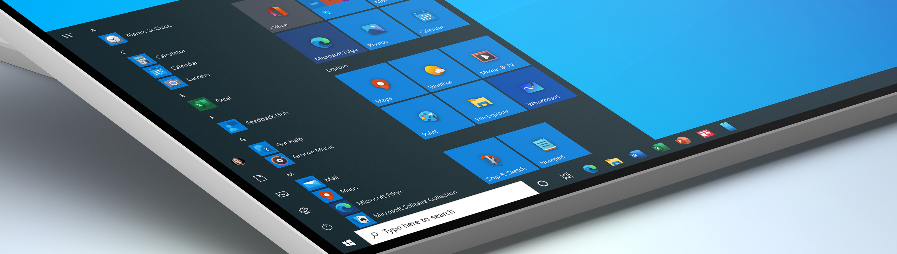

    <h1>
        windows10使用技巧
    </h1>
    

多总结才会有进步，处于提高效率的目的，总结下`windows10`的使用技巧。

### 快捷键

首先要理解快捷键的逻辑：为什么windows键盘上会有`win`、`Alt`、`Ctrl`和`Shift`键？

+ `win + ;`——打开表情输入🤞
+ `win + Q/S`——打开系统搜索框
+ `win + E`——打开文件资源管理器
+ `win + R`——打开运行
+ `win + U`——进到系统设置并定位在搜索框
+ `win + I`——进到设置并定位在搜索框
+ `win + P`——打开投影设置
+ `win + A`——打开通知
+ `win + D`——显示桌面
+ `win + G`——打开录屏
+ `win + K`——搜索连接设备
+ `win + L`——锁屏
+ `win + X`——相当于右击windows图标
+ `win + V`——打开剪贴板
+ `win + <`——显示桌面，`win`键松开返回当前应用

### 高效软件

#### 影音类

[ffmpeg](http://ffmpeg.org/)

跨平台解决方案，用于记录，转换和流传输音频和视频。极为强大的应用。可以用来为视频转码，也可以视频片段转换为gif图。

[potplayer](https://potplayer.en.softonic.com/)

windows平台下强大的媒体播放器，用了就懂。

#### 工具类

everything

全局文件搜索，安装完成后会有个构建索引的过程，一旦索引建好，搜索速度就会有很大的提升，不会出现搜索很久然后出来个没结果的情况。

Snipaste

截图软件，支持自定义截图后续动作。例如：自动保存，自动复制，贴图在编辑等。

