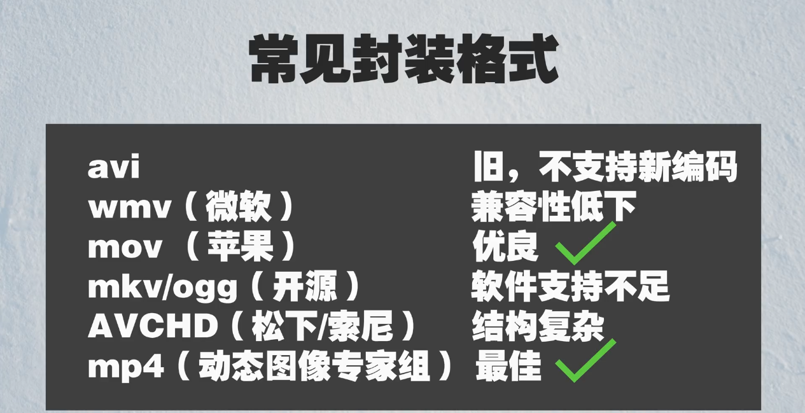
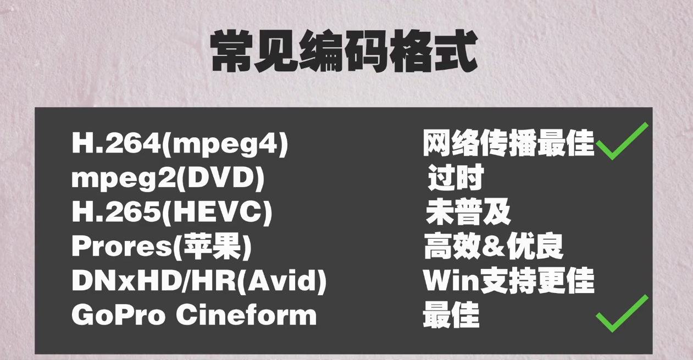

    
    

        photoed by Jakob Owens
    

 #### 封装格式

将图像、音频和媒体信息等打包在一起。

常见封装格式:

    

#### 码率

单位时间携带的数据量的大小。

+ 单位：视频——`Mbps`，音频——`kbps`

+ ~~码率 = 帧率 * 8 * 视频分辨率~~

  > 上面公式是自己想当然得出的😂，后面发现是不对的。

码率分为cbr（固定码率）与vbr（可变码率）

可变码率编码

从确保视频传输质量和充分利用信息的角度来说，可变码率视频编码才是最合理的。其理由是：视频信源本身的高峰信息量是变化的，若要使其输出码流的码率固定不变，则需要按信源的高峰信息量去设计传输系统，但大部分时间并不出现高峰信息量，为了确保码率固定，通常要插入一些填充码，这就浪费了视频资源。使用可变码率编码，就能按信源本身的信息量去分配，从而有效地利用信息资源。 [1] 

固定码率编码

通常固定码率视频编码算法是通过利用缓冲器状态改变量化器步长来实现的。当图像细节丰富时，为了确保缓冲器不溢出，就得加大量化步长，减少编码比特数，从而保证输出码流的码率恒定。这是以牺牲视频质量为代价的。因为加大量化步长会损伤图像的高频细节和低频背景，甚至产生“块效应”和图像细节模糊现象。所以当你用VCD机播放节目时，留心观察，就会发觉有时图像边缘出现“影环”现象。

#### 编码格式 

> 未压缩的时长为1小时的`1080P`视频大小大概是`500G`，所以视频一般都要进过编码。

1. 帧内(Intraframe)压缩：压缩率较低，适合剪辑
   1. Prores(苹果)
   2. DHxHD/HR(Avid)
   3. Cineform(GoPro)
   
2. 帧间(Interframe)压缩：压缩率较高，大大减小文件体积，但需要设备强大的性能去实现播放时的解码，适合最终输出。
   1. H.264(Mpeg4)
   2. mpeg2(DVD)
   3. H.265(HEVC)
   
   

       
   

 

